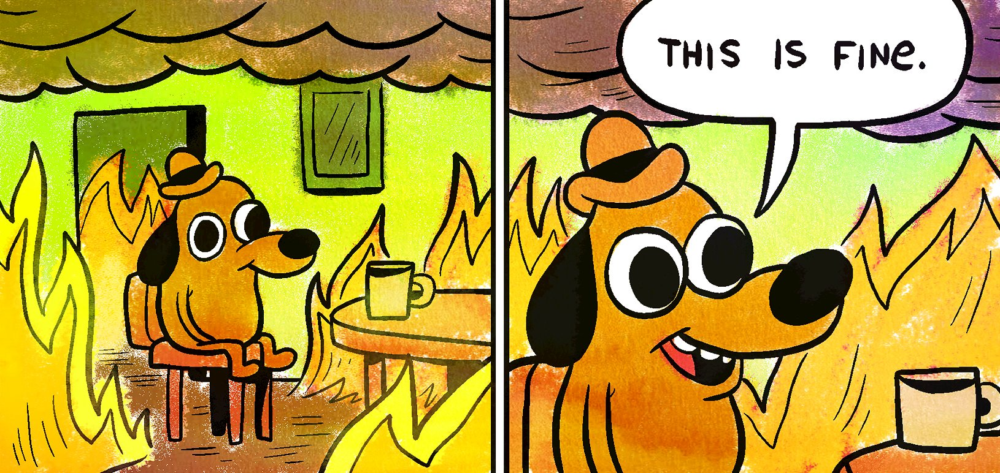

> "Yesterday was the best day to start. The next best day is today".

# Preamble
Hello world is a time honoured tradition in computer science. The first time you learn a programming language, one of the first things you do is you figure out how to make it print out something. In Python, this is fairly easy:

```python
print("Hello, world!")
```

In some other languages, you might have to bash your head against the wall for a bit to write the code to get the computer to tell you "Hello, world!", but in doing this exercise, it means you've done all of the required prerequisites:
* You've managed to download whatever software you need onto your computer
* You've set it up (hopefully) correctly
* You've executed a simple piece of code

Once you have done this a whole new world stands before you. The foundations have been laid, and what comes next is a world of possibility for what you might achieve next with the tools you now have at your disposal.

This name felt apt for my first blog, but through the course of this piece I want to describe how we need to view the climate crisis in a similar way. We need to reframe language to what we ought to be able to achieve with this new "toolkit", driven in large part by renewables. By setting out why I believe we should have a more optimistic narrative to a low-carbon future, I hope that this piece can stand the test of time, and be referred back to in the coming years and decades as we start to cross the required milestones to get to Net Zero. We hear often of "multiples-of-five" year policy deadlines:
> X needs to be done by {2025, 2030, 2035, 2040, 2050}

My hope is that as we cross these thresholds, our collective thinking towards net-zero has moved on considerably, perhaps even with some of the ideas in this blog being embraced (and others might be more wildly off-key!). I'd be interested to see how far off this vision (or, probably more correctly, this "brain-dump" thoughts and reflections) set in 2022 is from the world of the future.

# On the positivity of a low carbon future
The past couple of years haven't been great. 2020 brought with it a global pandemic unlike anything seen before in at least a century. This destabilised daily life and demanded a pause for reflection. During this time, the only glimmer of hope was the growing concensus of using this as an opportunity to "build back better". Yet, in 2022, that thinking has not materialised.


*Figure 1: Me, circa 2020 - 2022.*

## Non-renewables are framed as the default
We have built systems and structures around using carbon-based fuels. I'm not underestimating the already transformative change to move grids from coal to less carbon-intensive fuels such as gas, but they are still not carbon-free.

It reminds me of the story of the Dragon Tyrant [^dragon_tyrant]

* Words like “security of supply” and “xx” project an image of strength - that the system works. But we know it doesnt, operational costs are increasing [^increasing_operational_costs] etc
* Contrast with “intermittency” of renewables, which makes them sound fragile and unreliable
* Not just generation, happens with EV too - “range anxiety”. In practice, people don’t drive their cars long enough to be anxious - a mindset shift to “treat your car like your mobile phone” would be better. On a long day out where youre using the battery all day you might need to nip and charge it, but basically 99% of the time you have “all day battery life”.

## Why we should propose a more optimistic future
* What if intermittency was replaced with opportunity. It's a point of marketing and human psychology. Renewables are associated with fragility, and fossil fuels with stability
    * With Putin invasion of russia, this narrative is shattered, and we have this weird mix of fragility but also resilience in home-grown energy
    * So the default narrative of poiliticians is to pursue "home grown fossil fuels". This does not maximise our countries best assets. UK should pursue wind in the same way Spain should pursue solar.
* A grid designed to maximise and align demand with opportunity

# Why it’s pointless to talk about “hydrocarbons as a transition fuel”
* They create more jobs, but these jobs will not exist in 10 years.
* Companies like Uber, XXX existed as they spotted an opportunity to create a market
* The reason theyre widely successful, and globally replicable, is because someone was brave enough to define the market, figure out how to make it work and replicate at scale across the world
    * When people talk about these examples they are often accused of survivorship bias - only talking about the traits in the ones that "made it". But if we are to "make it" as a society through one of the most existential challenges, we need to align policy and business models in the direction of low carbon.
* Why aren’t countries grasping this opportunity to redefine the labour market for the next generation?

## Low carbon technology will only get cheaper
* Wind and solar is already the cheapest levelised cost of energy, but its getting cheaper to run. But it will only incentivise even wind and solar farms to be designed more efficiently, and optimised in their layout, their hardware, and their software
* Cheap, plentiful energy that means we can be a net exporter and pay people to use energy at certain times

<!-- Footnotes -->
[^dragon_tyrant]: A story by Nick Bostrom, in which the [Dragon Tyrant](https://en.wikipedia.org/wiki/The_Fable_of_the_Dragon-Tyrant) first descends on a village and starts eating people. It's too powerful to destroy with the technology of the time, so the people make a deal with the dragon to send a regular number of randomly chosen prisoners daily for the dragon to eat. The dragon grows in size as it eats more people, and the people set up systems to streamline the process of sending prisoners to the dragon (which creates economies and jobs), in an apparent resignation that there is any other way. As time progresses, so too does technology. Eventually scientists have an idea for a missile that will kill the dragon, but it will take over a decade to build and has no guarantee of success. The idea takes time to gain traction: many generations have only ever known life under the dragon; they have accepted it as a part of their life and are wary of change. It's only after a town hall meeting where younger people voice opposition to the dragon that a movement starts. There are many bumps in the road but the project is successful (albeit a few years later than the original decade forecasted). The missile kills the dragon and the people are left with a world of opportunity. While they would have to do things differently, this new world of possibility is exciting.

[^increasing_operational_costs]: Ofgem consistently notes [high balancing costs](https://www.ofgem.gov.uk/publications/open-letter-responding-high-balancing-costs)


