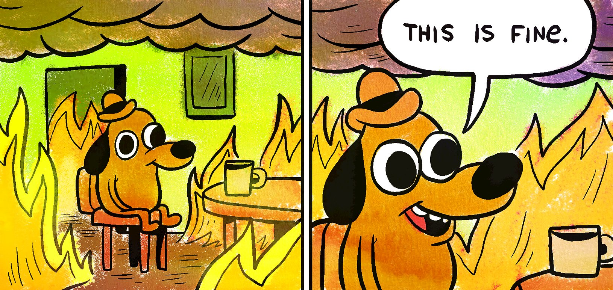

> "Yesterday was the best day to start. The next best day is today".

# Introduction
Hello world is a time honoured tradition in computer science. The first time you learn a programming language, one of the first things you do is you figure out how to make it print out something. In Python, this is fairly easy:

```python
print("Hello, world!")
```

In some other languages, you might have to bash your head against the wall for a bit to write the code to get the computer to tell you "Hello, world!", but in doing this exercise, it means you've done accomplished of the required prerequisites:
* You've got a computer, or server, capable of running some code
* You've managed to download whatever software you need onto your computer
* You've set it up (hopefully) correctly
* You've executed a simple piece of code

Once you have done this a whole new world stands before you. The foundations have been laid, and what comes next is a world of possibility for what you might achieve next with the tools you now have at your disposal.

This name felt apt for my first blog; I appear to have set up a decent blogging and personal website and now have all the tools at my disposal to write various pieces on various topics.

The topic I will likely most discuss will be the future energy system, though there will be articles on tech and AI too. I've wanted to start this blog for a long time, but keep putting it off. I think small, regular and insightful updates will be the best place to start.

## Our `Hello, world` mindset for the future energy system

I believe we are standing at a precipice. An inflection point. Our current energy system is yet to undergo the radical transformation seen in other sectors; one that puts data, decentralisation and people-centred automation at it's core.

I believe "shock events" can define the turning points for change, and if COVID-19 [^covid19] and Putin's war [^putin_war] aren't the catalyst for energy infrastructural and technical revolution then I'm not sure what will be. We need to go through what the finance sector did post-recession.

Luckily, we have all the "tools" we need in the form of ever-cheaper renewable generation. We just need a system that works with it symbiotically.

This is our "hello, world" moment.

## On the positivity of a low carbon future
The past couple of years haven't been great. 2020 brought with it a global pandemic unlike anything seen before in at least a century. This destabilised daily life and demanded a pause for reflection. During this time, the only glimmer of hope was the growing concensus of using this as an opportunity to "build back better". Yet, in 2022, that thinking has not yet materialised.


*Figure 1: Me, circa 2020 - 2022.*

In the next few blogs, I want to set out my current vision for an alternative energy system and why it can be a huge opportunity (powered by low-carbon fuels). This vision is likely to change, grow and crystallise over time. But we should propose a more optimistic future, and use human ingenuity to turn "bugs" into "features". "Challenges" into "opportunities". While learning from the transformation and evolution of other sectors.

It will be interesting to check back on this view in the coming decades, and see how much of it materialised or (hopefully) how much of it _under_ sold the value of an energy system based on low-carbon. In the same way that those who tried to predict the value of the internet "early" were "way off" when it came to its utility.

# This website and blog

I hope this website will be a useful tool for those wanting to use technology and AI in the energy sector. I hope, too, that it serves as a form of "documentation" of how my thoughts, beliefs and learnings evolve over the course of my career.

You can always reach out to contact me regarding tech, AI and the energy sector. See my `about` page for more infomation.


<!-- Footnotes -->
[^covid19]: [The COVID-19 / coronavirus pandemic, early 2020s](https://en.wikipedia.org/wiki/COVID-19_pandemic)

[^putin_war]: [Russia's invasion of Ukraine, 2022](https://en.wikipedia.org/wiki/2022_Russian_invasion_of_Ukraine)


